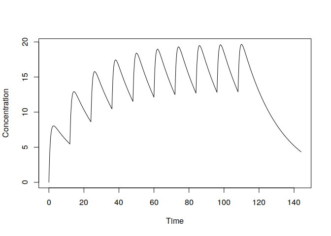

# linpk

[](https://github.com/benjaminrich/linpk/actions)
[](https://CRAN.R-project.org/package=linpk)
[](https://CRAN.R-project.org/package=linpk)

An R package for generating concentration-time profiles from linear pharmacokinetic (PK) systems.

## Installation

To install from CRAN:

``` r
install.packages("linpk")
```

To install the latest development version directly from GitHub:

``` r
require(devtools)
devtools::install_github("benjaminrich/linpk")
```

## Basic Usage

To simulate a PK profile from a one-compartment model with first-order absorption
under repeated dosing:

```r
t.obs <- seq(0, 6*24, 0.5)
y <- pkprofile(t.obs, cl=0.5, vc=11, ka=1.3, dose=list(amt=100, addl=9, ii=12))
plot(y)
```



For a more detailed introduction to the package, see the [vignette](https://benjaminrich.github.io/linpk/vignettes/linpk-intro.html).

## Shiny App

There is a companion shiny app that provides a demo of the package capabilities, and also
generates code that can be placed in an R script. It can be accessed at
<https://benjaminrich.shinyapps.io/linpk-demo-app/> or run locally by pasting
the following lines in an R console:

```r
# Make sure the required packages are installed (if not, install them)
sapply(c("shiny", "shinyjs", "shinyAce", "dygraphs", "linpk"), requireNamespace)
linpk::linpkApp()
```

The app will open in a browser, and looks like this:


