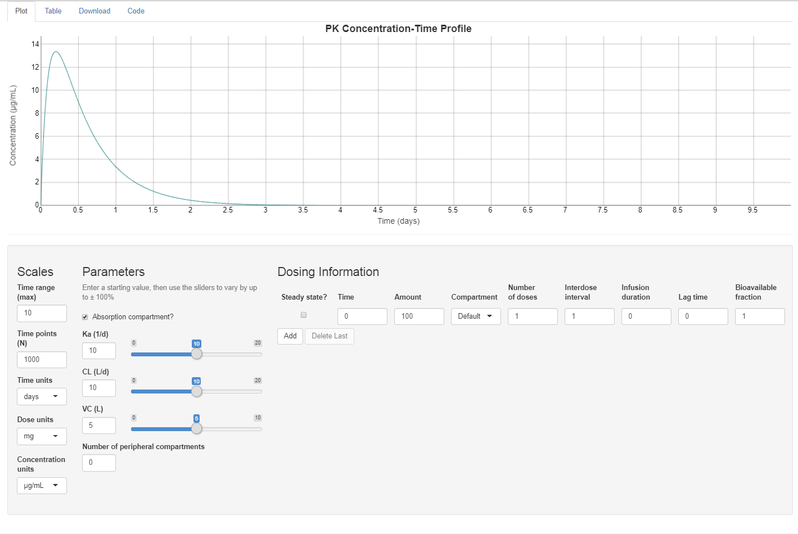

```{r echo=FALSE, message=FALSE, warning=FALSE, results='hide'}
knitr::opts_chunk$set(fig.align="center", fig.width=6, fig.height=4, warning=FALSE, message=FALSE)
options(width=120)
library(linpk, quietly=TRUE)
```

## Introduction

If you work in pharmacometrics, you have probably at some time or another
written code to generate concentrations from a PK model by implementing the
closed-form solution to a simple system of linear differential equations. The
mathematical equations are readily available in many textbooks or online (for
instance, [Mathematical Expressions of the Pharmacokinetic and Pharmacodynamic
Models implemented in the
Monolix](https://mlxtran.lixoft.com/wp-content/uploads/sites/2/2016/02/PKPDlibrary.pdf)
software by Bertrand and Mentr&eacute;).

Each formula is specific with regard to:

- Dosing type: bolus, infusion (zero-order), absorption (first-order)
- Number of doses: single, multiple, at steady state
- Number of compartments: 1, 2, 3, ...

Implementing a different function for each combination you are likely to
encounter is cumbersome, time consuming and error prone. Enter the `linpk`
package, which conveniently uses a single function, `pkprofile`, to handle all
combinations of the above.

Meanwhile, there are now powerful and efficient ODE solvers in R that make it
easy to simulate from any PK model, including
[mrgsolve](https://mrgsolve.org/),
[PKPDsim](https://github.com/InsightRX/PKPDsim), and
[RxODE](https://github.com/nlmixrdevelopment/RxODE). These packages are much
more powerful than `linpk`, which can only solve *linear* systems of ODE. What
`linpk` offers in return is convenience; most models can be simulated from
using a single line of code, and there is no need to write out the model in
differential equation form or perform a compilation step. In addition, `linpk`
has built-in convenience functions to calculate secondary PK parameters, such
as half-life, AUC or Cmax, from the simulated concentration-time profile.


## Getting started

The first example will be deliberately simple, a 1-compartment model and
a single IV bolus dose. This will serve as a starting point to see how more
complex models and dosing can be accommodated.

First, we will create a vector of times at which to generate concentrations. In
this example it will be a fine grid of equally-spaced time points from 0 to 24
hours:

```{r}
t.obs <- seq(0, 24, 0.1)
```

(A note on units: here we are assuming here that time is hours, but we are free
to use any time unit we like, as long as the units for clearances and rate
constants correspond. For instance, if time is in days, and volume in L, than
clearance is in L/day).

Next, we use `pkprofile` to generate the concentrations at those times
following a 100 mg IV bolus dose, and assuming a clearance of 0.5 L/h and
a (central) volume of 11 L:

```{r}
y <- pkprofile(t.obs, cl=0.5, vc=11, dose=list(amt=100))
plot(y)
```

There are a few things to note here. One is that the dose argument is a `list`;
it can also be a `data.frame` (which is a special kind of list).

The object `y` is a simple object that can essentially be treated as a numeric
vector of concentrations at the times `t.obs`, but it also has a few methods
for convenience (for instance, it can be plotted). The result can also be
converted to a `data.frame`, with columns `time` and `conc` by default:

```{r}
sim <- as.data.frame(y)
tail(sim)
```

## Dosing type

To change from an IV bolus to an infusion, we simply add either the `dur`
(duration) or `rate` of the infusion to the dose list argument. For example, to
simulate the same 100 mg dose but infused over 90 minutes, we would do:

```{r}
y <- pkprofile(t.obs, cl=0.5, vc=11, dose=list(amt=100, dur=1.5))
plot(y)
```

To simulate an oral dose (i.e., a dose administered to a depot compartment with
first-order absorption), we simply specify the absorption rate constant `ka`:

```{r}
y <- pkprofile(t.obs, cl=0.5, vc=11, ka=1.3, dose=list(amt=100))
plot(y)
```

The function recognizes by the presence of this parameter that a first-order
absorption is required. Note that if both `dur` (or `rate`) and `ka` are
specified, then the function will deduce that the dose is infused into the
depot compartment.

A dose may have an associated time `lag` and bioavailability (`f`) (note that
`lag` and `f` are associated to a *dose*, not to a *compartment* as in NONMEM).
These parameters can be added to the dose list argument as necessary:

```{r}
y <- pkprofile(t.obs, cl=0.5, vc=11, ka=1.3, dose=list(amt=100, lag=0.4, f=0.6))
plot(y)
```

## Multiple doses

There are two ways to specify multiple doses to `pkprofile`. The first is to
add dose times to the dose list argument:

```{r}
y <- pkprofile(t.obs, cl=0.5, vc=11, ka=1.3, dose=list(t.dose=c(0, 12), amt=100))
plot(y)
```

In this example, we have simulated two doses, one given at time zero, and the
second at 12 hours. Note that vector *recycling* has been applied to `amt` to
match the number of doses (this is generally true for items in the dose list;
shorter items are recycled to match the longest item in the list). We can also
specify different amounts for each dose:

```{r}
y <- pkprofile(t.obs, cl=0.5, vc=11, ka=1.3, dose=list(t.dose=c(0, 12), amt=c(100, 50)))
plot(y)
```

It is also possible to use a `data.frame` (which is a type of list) to specify doses:

```{r}
doses <- data.frame(t.dose=c(0, 12), amt=c(100, 50))
doses
y <- pkprofile(t.obs, cl=0.5, vc=11, ka=1.3, dose=doses)
plot(y)
```

The second way to specify multiple doses is to use the `addl` argument for
*additional* doses, along with the *inter-dose interval* `ii`. Thus, to
simulate regular doses of 100 mg every 12 hours for 5 days, we could do the
following:

```{r}
t.obs <- seq(0, 6*24, 0.5)
y <- pkprofile(t.obs, cl=0.5, vc=11, ka=1.3, dose=list(amt=100, addl=9, ii=12))
plot(y)
```

A different way of achieving the same, without using `addl`, is to use `seq()` to
specify a vector of dose times:

```{r}
y <- pkprofile(t.obs, cl=0.5, vc=11, ka=1.3, dose=list(t.dose=seq(0, 9*12, 12), amt=100))
plot(y, col="red")
```

We can, of course, mix the different options as well. To specify 100 mg doses
every 24 hours, with an extra dose of 50 mg at 14 hours on day 3, we can do the
following:

```{r}
y <- pkprofile(t.obs, cl=0.5, vc=11, ka=1.3,
    dose=list(t.dose=c(0, 24*2 + 14), amt=c(100, 50), addl=c(4, 0), ii=24))
plot(y)
```

A `data.frame` with all the realized doses can also obtained using the
`dose.frame` function:

```{r}
dose.frame(y)
```

## Doses at steady state

One can specify a dose given at steady state by adding `ss=T` or `ss=1` to the
dose list argument. Going back to a previous examples, we had regular regular
doses of 100 mg every 12 hours for 5 days. To see that steady state has been
reached after 5 days, let us overlay the steady state profile in green:

```{r}
t.obs <- seq(0, 6*24, 0.5)
y <- pkprofile(t.obs, cl=0.5, vc=11, ka=1.3, dose=list(amt=100, addl=9, ii=12))
plot(y)
yss <- pkprofile(t.obs, cl=0.5, vc=11, ka=1.3, dose=list(amt=100, addl=9, ii=12, ss=T))
lines(yss, col="green3")
legend("bottomright", c("Steady state"), col=c("green3"), lty=1, bty="n")
```

## Number of compartments

The `pkprofile` function makes it easy to specify models with 1, 2, 3 or more
compartments (practically speaking, you will never go over 3 compartments, but
the function is not restricted). The way to specify the number of compartments
is to include the parameters that are appropriate to the model.  The mandatory
parameters are `cl` and `vc`. For a 2-compartment model, add `q` and `vp`:

```{r}
t.obs <- seq(0, 24, 0.1)
y2 <- pkprofile(t.obs, cl=0.5, vc=11, q=2, vp=30, ka=1.3, dose=list(amt=100))
```

For a 3 (or more) compartments, you can specify `q` and `vp` as vectors:

```{r}
y3 <- pkprofile(t.obs, cl=0.5, vc=11, q=c(2, 0.3), vp=c(30, 3), ka=1.3, dose=list(amt=100))
plot(y2)
lines(y3, col="green3")
legend("topright", c("2-Compartment", "3-Compartment"), col=c("black", "green3"), lty=1, bty="n")
```

## Secondary parameters

### Half-lives

`linpk` makes it quite easy to access some secondary parameters from the PK
model and simulation. The half-lives of the model can be obtained directly
using the `halflife()` function. For instance for the 3-compartment model with
first-order absorption in the previous section:

```{r}
y <- pkprofile(t.obs, cl=0.5, vc=11, q=c(2, 0.3), vp=c(30, 3), ka=1.3, dose=list(amt=100))
halflife(y)
```

There are 4 components: the $\alpha$, $\beta$ and $\gamma$ half-lives, as well
as the absorption half-life.

Note that computing the half-life doesn't require any doses or sampling. For example, this 2-compartment model:

```{r}
halflife(pkprofile(cl=0.5, vc=11, q=2, vp=30))
```

### Other secondary parameters (Cmin, Cmax, AUC, ...)

Other secondary parameters are accessed using the `secondary()` function:

```{r}
secondary(y)
```

**Note that these secondary parameters are computed based on the simulated
profile, so the time points specified in `t.obs` are important and relevant.**
This function optionally takes arguments `From` and `To` to specify intervals
over which the parameters are computed. Looking at an example with multiple
dosing, we observe that when not specified, the default is to compute secondary
parameters over the intervals defined by the dose times:

```{r}
t.obs <- seq(0, 5*24, 0.1)
y <- pkprofile(t.obs, cl=0.5, vc=11, q=2, vp=30, ka=1.3, dose=list(amt=100, addl=5, ii=24))
plot(y)
secondary(y)
```

But we can easily ask for the AUC from 0 to 12 hours, 0 to 48 hours, and 48 to
128 hours, for instance:

```{r}
secondary(y, From=c(0, 0, 48), To=c(12, 48, 128))
```

## Combining IV infusion with first-order absorption

It is possible to specify the compartment that a particular dose is administered
to using the `cmt` element of the dosing list argument. The central compartment
is always associated with the number 1, while specifying `cmt=0` indicates that
the dose goes to the default dosing compartment, which is the depot compartment
in the presence of `ka` (first-order absorption), and the central compartment
otherwise. This feature is used in the following example to simulate a scenario
in which a 150 mg IV dose is administered at time zero, followed by daily
subcutaneous 10 mg doses (first-order absorption) on days 8 to 20 (here we will
assume that the unit of time is days so clearance is in L/day). In this example,
we specify the dose list as an external `data.frame`:

```{r}
t.obs <- seq(0, 20, 0.1)
doses <- data.frame(t.dose=c(0, 7), amt=c(150, 10), addl=c(0, 12), ii=1, cmt=c(1, 0), dur=c(1/24, 0))
doses
y <- pkprofile(t.obs, cl=0.8, vc=6, q=0.09, vp=4.5, ka=1.3, dose=doses)
plot(y, col="blue", main="150 mg IV at time zero, 10 mg SC QD on days 8 to 20", xlab="Time (days)")
```

## Time-varying parameters

Time-varying parameters are not handled directly. Systems with parameters that
vary continuously over time are not linear and hence outside the scope of
`linpk`. However, if parameters change at a discrete set of time points, and the
system is linear between those time points, it is possible to advance the system
in discrete steps. To do so, we can use the object returned by `pkprofile` as
the first argument in a subsequent call in order to append to the existing
profile. For example, the following simulates a scenario with daily oral dosing
where clearance increases by 20% each day:

```{r}
t.grid <- seq(0, 24, 0.1)
t.dose <- seq(0, by=24, len=8)
cl0 <- 0.1; cl <- cl0; ka <- 0.5; vc <- 10
y <- pkprofile(t.obs=t.grid, cl=cl, vc=vc, ka=ka, dose=list(t.dose=0))
for (day in 2:8) {
    cl <- 1.2*cl
    y <- pkprofile(y, t.obs=t.grid + t.dose[day], cl=cl, vc=vc, ka=ka, dose=list(t.dose=t.dose[day]))
}
plot(y, main="Clearance increasing by 20% each day")
```

***Caution:*** This approach does NOT work if the parameters change in the
middle of a zero-order infusion. In that case, it would be necessary to split
the infusion at the time when the parameters change.

## Shiny app

The package includes a small shiny app for interactive exploration. To run it locally,
the following packages must be installed:
[shiny](https://CRAN.R-project.org/package=shiny),
[shinyjs](https://CRAN.R-project.org/package=shinyjs),
[shinyAce](https://CRAN.R-project.org/package=shinyAce),
[dygraphs](https://CRAN.R-project.org/package=dygraphs).
It can then be run by the command:

```{r eval=F}
linpk::linpkApp()
```

The app will open in a browser, and looks like this:

{width=100%}

You can enter different doses, vary the PK parameters by number or slider, and
modify the units and time scale. There are tabs along the top to show a table
of derived secondary parameters, to download a CSV file of the simulated data
points, and to generate source code for the simulation that can be copied
directly to a script.

## Limitations

Compared to more general ODE solvers ([mrgsolve](https://mrgsolve.org/),
[PKPDsim](https://github.com/InsightRX/PKPDsim),
[RxODE](https://github.com/nlmixrdevelopment/RxODE)), this package has some
limitations, the most obvious being that it can only simulate from *linear* PK
models. This means that it cannot be used to simulate from most PD models, for
instance. Another disadvantage is that simulating time-varying parameters must
be done with iterative function calls.

